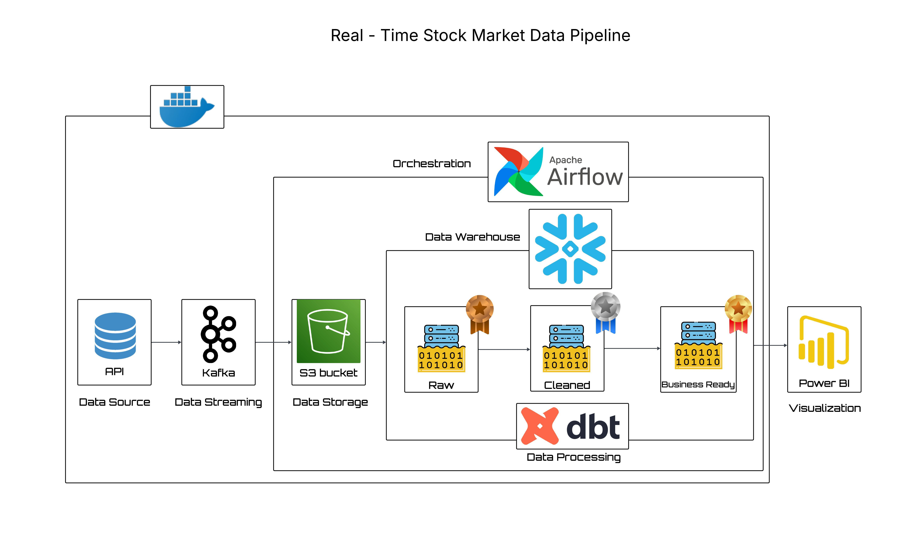

# Real-Time Stocks Market Data Pipeline


---

## 📌 Project Overview

This project demonstrates an **end-to-end real-time data pipeline** using the **Modern Data Stack**.  
We capture **live stock market data** from an external API, stream it in real time, orchestrate transformations, and deliver analytics-ready data — all in one unified project.

> ⚠️ **Note:** The visualization layer (Power BI dashboard) has **not been implemented yet** and is planned as a future addition.



---

## ⚡ Tech Stack

| Tool | Purpose |
|---|---|
| **Snowflake** | Cloud Data Warehouse |
| **dbt** | SQL-based Transformations |
| **Apache Airflow** | Workflow Orchestration |
| **Apache Kafka** | Real-time Streaming |
| **Python** | Data Fetching & API Integration |
| **Docker** | Containerization |

---

## ✅ Key Features

- Fetches **live stock market data** (not simulated) from the Finnhub API
- Real-time streaming pipeline with **Kafka**
- Orchestrated ETL workflow using **Airflow**
- Transformations using **dbt** inside Snowflake (Bronze → Silver → Gold)
- Scalable cloud warehouse powered by **Snowflake**

---

## 📂 Repository Structure

```text
dbt-stocksmds/
├── producer/                     # Kafka producer (Finnhub API)
│   └── producer.py
├── consumer/                     # Kafka consumer (MinIO sink)
│   └── consumer.py
├── dbt_stocksmds/models/
│   ├── bronze/
│   │   ├── bronze_stg_stock_quotes.sql
│   │   └── sources.yml
│   ├── silver/
│   │   └── silver_clean_stock_quotes.sql
│   └── gold/
│       ├── gold_candlestick.sql
│       ├── gold_kpi.sql
│       └── gold_treechart.sql
├── infra/                        # Infrastructure configs
├── snowflake_config.sql          # Snowflake setup SQL
├── requirements.txt
└── README.md
```

---

## 🚀 Getting Started

1. Clone this repo and install dependencies:
   ```bash
   git clone https://github.com/Billy-j0/dbt-stocksmds.git
   cd dbt-stocksmds
   pip install -r requirements.txt
   ```
2. Start Kafka, Zookeeper, MinIO, Airflow, and Postgres via Docker:
   ```bash
   docker-compose up -d
   ```
3. Run the Kafka producer to begin fetching live stock data
4. Data flows into MinIO → Airflow loads it into Snowflake → dbt applies transformations
5. Query the Gold layer tables in Snowflake for analytics-ready data

---

## ⚙️ Step-by-Step Implementation

### 1. Kafka Setup
- Configured **Apache Kafka** locally using Docker
- Created a `stocks-topic` to handle live stock market events
- Defined producers (API fetch) and consumers (pipeline ingestion)

---

### 2. Live Market Data Producer
- Python script [`producer/producer.py`](producer/producer.py) fetches **real-time stock prices** from the **Finnhub API**
- Streams stock data into Kafka in JSON format

---

### 3. Kafka Consumer → MinIO
- Python script [`consumer/consumer.py`](consumer/consumer.py) consumes streaming data from Kafka
- Persists consumed data into **MinIO buckets** (S3-compatible storage)
- Organizes storage into folders aligned with the raw/bronze ingestion layer

---

### 4. Airflow Orchestration
- **Apache Airflow** initialized in Docker via the `infra/` directory
- DAG loads data from MinIO into **Snowflake staging tables**
- Scheduled to run every **1 minute** for near-real-time ingestion

---

### 5. Snowflake Warehouse Setup
- Database, schema, and warehouse provisioned using [`snowflake_config.sql`](snowflake_config.sql)
- Staging tables defined for the **Bronze → Silver → Gold** medallion architecture

---

### 6. dbt Transformations
- dbt project configured with a Snowflake connection
- Three-layer medallion model:
  - **Bronze** → raw structured data from staging
  - **Silver** → cleaned and validated data
  - **Gold** → analytical views (Candlestick, KPI, Tree Map)

---

## 🔮 Planned: Visualization Layer

> The **Power BI dashboard** has not been built yet. Once completed, it will connect directly to the Snowflake Gold layer via Direct Query and include:
> - Candlestick charts for stock price patterns
> - Tree charts for relative stock performance
> - Gauge charts for volume metrics
> - KPI cards with real-time sortable views

---

## 📊 Current Deliverables

- ✅ Automated real-time data pipeline (Kafka → MinIO → Snowflake)
- ✅ Snowflake tables (Bronze → Silver → Gold)
- ✅ Transformed analytics models with dbt
- ✅ Orchestrated DAGs in Airflow
- 🔲 Power BI dashboard *(coming soon)*

---

**Author**: *William Johnson*  
**LinkedIn**: [William Johnson](https://www.linkedin.com/in/william-johnson-chalissery/)  
**Contact**: [williamjonson077@@gmail.com](mailto:williamjonson077@@gmail.com)
